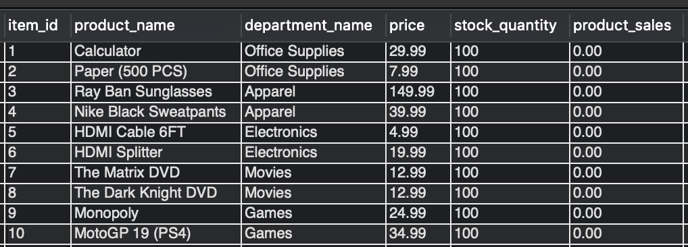
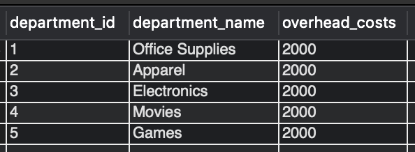
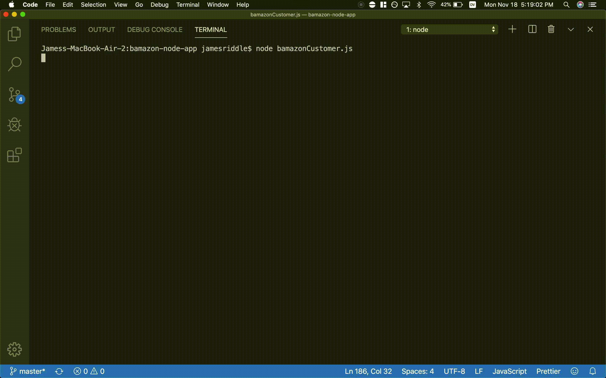
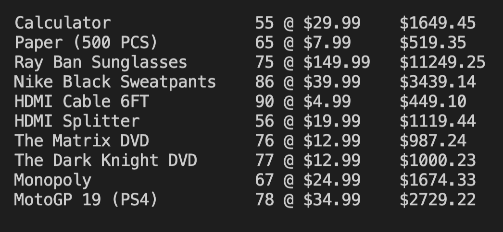
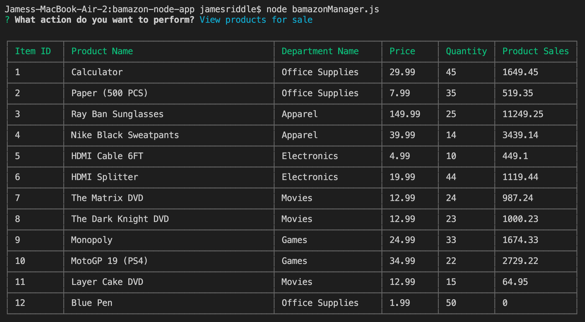
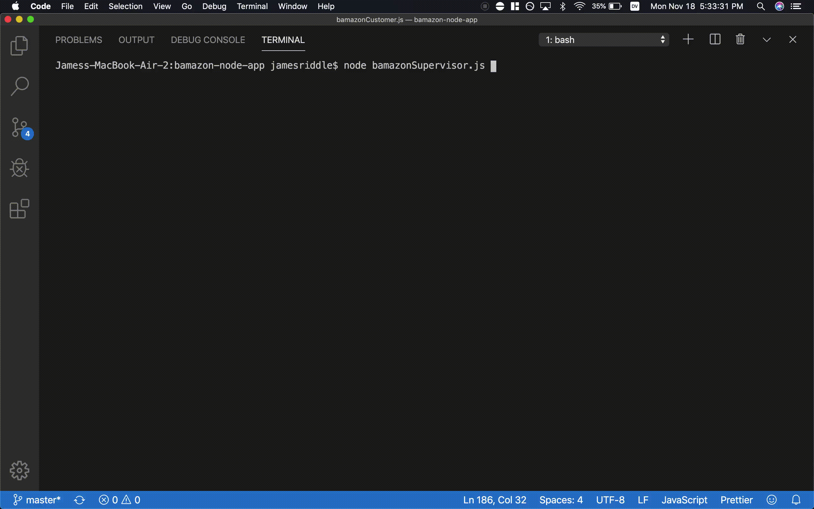
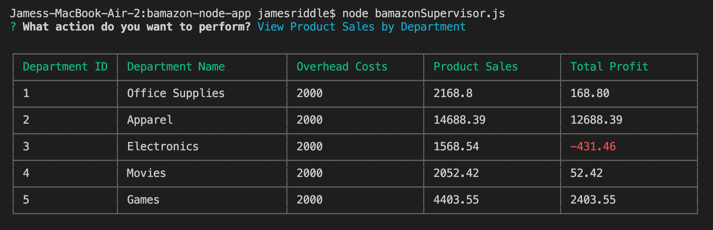
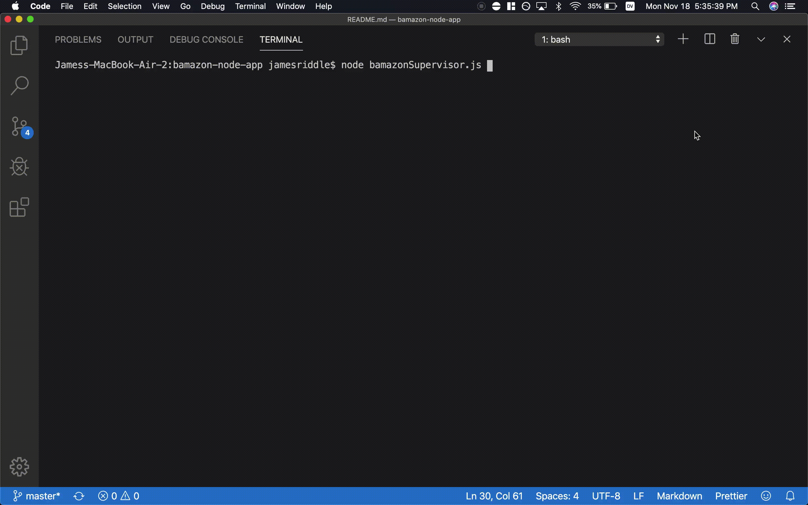
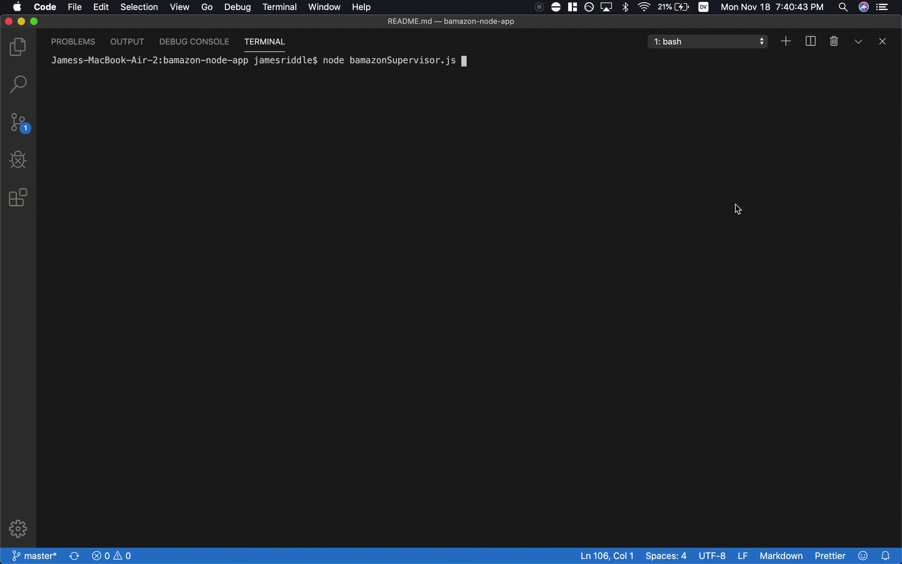

# Bamazon NodeJS App

### What this app does:
This app resembles a store's server-side data processing. Customer purchases are tracked in a database, so the store's real-time inventory and product sales can be viewed by managers/supervisors. Furthermore, managers can view product inventory, update inventory, and add products. Lastly, supervisors can add new departments and view product sales by department. Below, there are gifs showing how the app works for the 3 different users.

------------
## Initial Database Configuration 

#### Products Table 

#### Departments Table 

---------

## General Tasks: 

#### Customer purchasing multiple items

#### Customer purchasing more product than current stock level

#### Manager viewing/updating inventory

--------- 

## Adding a New Product: 

#### Manager adding a new product

#### Customer purchasing a product created in the app

#### Manager updating inventory for a product created in the app

--------- 

## Real-Time Product Sales Numbers: 

#### Manager viewing updated product sales numbers after numerous purchases

Simulating numerous customers buying various items

Here's a still image of the final receipt to verify that the numbers check out later

Updated manager's view of store inventory after running `node bamazonManager.js` (Remember that all of the quantity numbers started at 100)

#### Supervisor now viewing product sales by department

Still image of supervisor's departments table in order to verify the numbers

--------- 

## Adding a New Department: 

#### Supervisor adding a new department

#### Manager adding a product to the department creaated in the app

#### Customer buying the new product and the supervisor viewing the sales numbers in real-time

--------- 

## Catching Invalid Inputs:

#### Customer inputting invalid information

#### Manager inputting invalid information

#### Supervisor inputting invalid information

